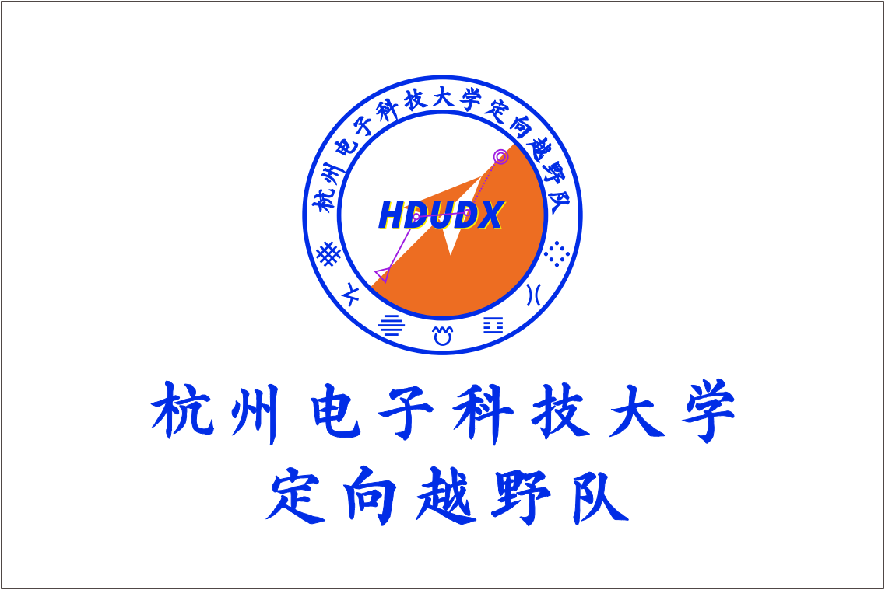

这里是[杭州电子科技大学定向队](https://hdudx.githb.io)。

我们成立于2012年，距今已有12年之久。在这百废俱兴之时，23年定向队队长[张慧源](https://zhywyt.github.io)创建了这个主页，希望能增强定向队队员归属感，收集历届定向队员信息、比赛经历、队员故事等……也可以是记录我们定向队这个大家庭的轶闻趣事——

## 杭州电子科技大学定向越野队队史

杭州电子科技大学定向队成立于2012年，17年裘睿队长、18年戴凌涛队长、19（20）年陈文麒队长、21（22）年金益群队长、23年张慧源队长、24年祝小雅队长。定向越野队在历任队长的带领和队员的不断努力下，不断发展壮大，我们始终秉承“团结协作，挑战自我”的精神，积极参与各类赛事和活动。 作为一项需要大量投入的运动项目：定向越野不仅需要宽阔的野外场地、专业的定向设备，还需要有强大的后勤支撑，每次训练都需要专业的设备支撑：指北针、定向图、越野免接触打卡设备……尽管艰难险阻，我们定向越野队依然砥砺前行。在浙江省第十三届学生定向赛上获得优异的成绩，李云鹏同学在浙江省第十四届大学生运动会定向比赛上获得男子甲组短距离赛第三名，在2018年浙江省定向锦标赛上胡泽宇同学和获得了成年男子组短距离第六名、百米第四名、中距离定向第六名，裘睿同学获得了成年女子组短距离第八名、她和刘瑞琪同学一起获得了2人接力赛第八名，戴凌涛同学还获得了个人体育道德风尚奖。而在2019年，也就是疫情爆发的那段时间，定向越野活动全面停摆，队员无法训练，老队员也在准备升学和工作。在定向队危急存亡的关头，队员们都没有放弃，面对疫情，队员们坚持体能训练，队长也不断地鼓励我们队员，带领队员们积极参加校内外比赛，培养了良好的团队精神。直到现在疫情开放了，我们队伍的实力也在慢慢恢复，近期吴梓霆同学刻苦训练在2023 Spartan Trail in Chongli-21KM/1210m+越野赛以2:47:28完赛，取得了第七名的好成绩、更是在Inception of Dreams at Night Mountain Track Race - 14km/590m+比赛中，以1:45:05获得第一名的好成绩。ITRA越野积分达到了530。我们定向队不只是运动的快乐，更有朋友的喜悦，欢迎加入我们定向队的大家庭。

## 重大事件

**2024-11-22**定向队在2024浙江省青少年定向锦标赛上取得一银、一铜、第四、第六、第七的好成绩，当时仅仅派出了五名队员参加了十二项项目，总共获得了六个奖项，成绩可喜可贺。同时作为近五年来第一场省级及以上级别的比赛，也让定向队焕发生机，一时间人才涌现。定向队的故事还在书写。

**2025-7-29**定向队在2025全国青少年定向锦标赛在仅有三名队员参赛的情况下，取得了三个国三的好成绩。作为定向队复赛以来第一次参加全国性定向比赛，该比赛让队员们能够和全国各地的高手竞争，与优秀的教练一起复盘，收获颇丰！也真正地为定向队带来了技术的萌芽。